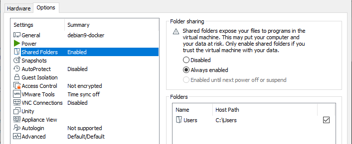
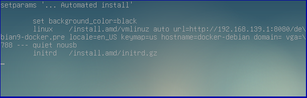
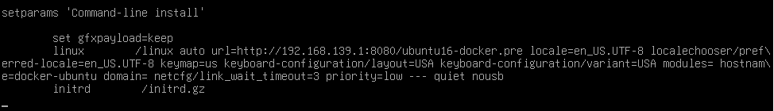

# VMware `docker-machine`

Implement Linux `docker-machine` on VMware Workstation/Player, VirtualBox,...

## Generate certificates for Docker TLS

### On Linux

Boot to [SystemRescueCD](https://www.system-rescue.org/) on an empty Virtual Machine, then execute `generate-tls.sh` on that

- Set root password and turn-off Firewall on `SysRescue` VM

```bash
# Get IP of the VM
ip r

echo 'root:toor' | chpasswd
systemctl stop iptables
```

- Send `generate-tls.sh` script to the VM then execute `generate-tls.sh [<Docker machine IP>]` to generate certificates

```bash
scp generate-tls.sh docker-ssl.cnf root@192.168.139.148:~

ssh root@192.168.139.148
chmod +x *.sh
./generate-tls.sh 192.168.139.140
exit

# Copy generated certificates back to the local
scp "root@192.168.139.148:~/{*.tgz,*.txt}" .
```

### On Windows

Prerequisites (`OpenSSH Client` and `7-Zip` are optional on Windows 10):

- OpenSSL v1.1.x (e.g. http://wiki.overbyte.eu/arch/openssl-1.1.1n-win64.zip)
- OpenSSH Client v7.x (e.g. https://github.com/PowerShell/Win32-OpenSSH/releases/download/v7.7.2.0p1-Beta/OpenSSH-Win64.zip)
- 7-Zip >= v19.0 (e.g. https://www.7-zip.org/a/7z1900-extra.7z)

Install them by extracting necessary executable files into any folder and export `PATH` environment variable for that

```batch
powershell -command "Expand-Archive -Force misc\tools-win64.zip C:\Apps\tools-x64"
set "PATH=%PATH%;C:\Apps\tools-x64"
```

Then execute `generate-tls.cmd [<Docker machine IP>]` to generate certificates, e.g. `generate-tls.cmd 192.168.139.140`

## Install Docker Client on Windows

- Extract [docker-ce-19.03.13_compose-1.29.2.zip](../../releases/download/202207/docker-ce-19.03.13_compose-1.29.2.zip)
  and copy [docker-machine.cmd](./docker-machine.cmd) files into `%ProgramFiles%\Docker` folder
  and export `PATH` environment variable for that

  + `Docker CE 19.03.13` was extracted from [Docker Desktop Community 2.4.0](https://docs.docker.com/desktop/previous-versions/2.x-windows/)
  + `Docker Compose 1.29.2` was extracted from [Docker Desktop 3.4.0](https://docs.docker.com/desktop/previous-versions/3.x-windows/)

- *Extract `certificates.tgz` file into `%USERPROFILE%\.docker\machine\certs` folder*

- Setup environment variables for `Docker Client` (to edit via GUI, run `rundll32.exe sysdm.cpl,EditEnvironmentVariables`)

```batch
set "PATH=%PATH%;%ProgramFiles%\Docker"

set COMPOSE_CONVERT_WINDOWS_PATHS=true
set "DOCKER_MACHINE_VMX=path\to\debian9-docker.vmx"
set "DOCKER_CERT_PATH=%USERPROFILE%\.docker\machine\certs"

rem For unsecured Docker Server
set "DOCKER_HOST=tcp://192.168.139.140:2375"

rem For Docker Server using generated TLS
set "DOCKER_HOST=tcp://192.168.139.140:2376"
set DOCKER_TLS_VERIFY=1
```

## Create the Virtual Machine

Recommended:

- OS: Debian 9.x 64-bit (or `Linux 4.x 64-bit` for `Alpine Linux`)
- VM name: debian9-docker
- CPU: 1 / Core: 4 (correspond with the system)
- Memory: 4GB (or 2GB for `Alpine Linux`)
- Printer: `<Removed>`
- Sound: `<Removed>`
- USB: `<Removed>`
- Network: NAT (generated MAC)
- Display: <Auto without 3D accelerator>
- CDROM: <Use ISO image: path\to\debian-9.13.0-amd64-netinst.iso>
- HDD1: 8GB
- HDD2: 20GB


- Firmware: UEFI
- Shared Folders: <Always enabled C:\Users>



## Setup Docker machine on Debian 9

Start a local static web server to provide preseed and generated certificate files

- Execute `php -S 0.0.0.0:8080` for installed `PHP 5+`
- Or execute `python -m http.server 8080` for installed `Python 3` (`SimpleHTTPServer` for `Python 2`)
- Or execute `C:\Apps\tools-x64\simple-http-server -i -p 8080 .` (extracted from [misc/tools-win64.zip](./misc/tools-win64.zip))

Boot to ISO image [debian-9.13.0-amd64-netinst.iso](https://cdimage.debian.org/cdimage/archive/9.13.0/amd64/iso-cd/)
on the created [debian9-docker VM](#create-the-virtual-machine),
then install with boot parameters: `auto url=http://192.168.139.1:8080/debian9-docker.pre --- nousb`
(run `ipconfig` to get IP address for VMware NAT Network Adapter `VMnet8`)

- Choice `Advanced options ...`
- Select `... Automated install` and press `E` to edit boot parameters
- Correct boot parameters and press `F10` to start installation
  (e.g. `auto url=... locale=en_US.UTF-8 keymap=us modules= hostname=docker-debian domain= netcfg/link_wait_timeout=3`)



Finally, correct CDROM configurations (e.g. using raw-cdrom, disable auto-connect,...) for the VM

```bash
# For the first boot
sudo rm -rf /var/cache/apt/* /var/lib/apt/lists/* /var/log/installer /var/log/apt/term* /tmp/* /tmp/.??*; \
sudo sed -i 's/\(_DEFAULT *= *"[^"]*\) profile/\1/' /etc/default/grub; sudo update-grub2; \
sudo rm -rf .bash_history /tmp/* /tmp/.??* /var/log/vmware*.*.log; \
sudo truncate -s0 /var/log/syslog /var/log/messages /var/log/debug /var/log/kern.log /var/log/daemon.log /var/log/vmware*.log; \
history -c; sudo poweroff
```

## Setup Docker machine on Alpine Linux 3

Start a local static web server to provide setup files (@see [Setup Docker machine on Debian 9](#setup-docker-machine-on-debian-9))

*Or using HDD2 as temporary storage to send setup files to the VM with `VMware Workstation` disk mapping feature*

Boot to ISO image [alpine-virt-3.11.13-x86_64.iso](https://dl-cdn.alpinelinux.org/alpine/v3.11/releases/x86_64/)
on the created [alpine3-docker VM](#create-the-virtual-machine), then get the setup script

```bash
printf '\n\n\n' | setup-interfaces
ifup eth0
wget -q "http://$(ip r | grep '\.0/' | sed 's,\.0/.*,.1,'):8080/alpine3-docker-setup.sh"
ifdown eth0

# Install automatically
chmod +x *.sh
./alpine3-docker-setup.sh
```

Finally, correct CDROM configurations (e.g. using raw-cdrom, disable auto-connect,...) for the VM and reboot

```bash
# For the first boot
sudo rm -rf .ash_history /tmp/* /tmp/.??*; \
sudo truncate -s0 /var/log/messages /var/log/dmesg /var/log/*.log; \
history -c; sudo poweroff
```

## Setup Docker machine on Ubuntu 16

Start a local static web server to provide preseed and generated certificate files
(@see [Setup Docker machine on Debian 9](#setup-docker-machine-on-debian-9))

Boot to ISO image [ubuntu-16.04.7-mini-amd64.iso](http://cdimages.ubuntu.com/netboot/)
on the created [ubuntu16-docker VM](#create-the-virtual-machine),
then install with boot parameters: `auto url=http://192.168.139.1:8080/ubuntu16-docker.pre --- nousb`

- Select `Command-line install` and press `E` to edit boot parameters
- Correct boot parameters and press `F10` to start installation
  (e.g. `auto url=... locale=en_US.UTF-8 keymap=us modules= hostname=docker-ubuntu domain= netcfg/link_wait_timeout=3`)



Finally, correct CDROM configurations (e.g. using raw-cdrom, disable auto-connect,...) for the VM

```bash
# For the first boot
sudo rm -rf /var/cache/apt/* /var/lib/apt/lists/* /var/log/installer /var/log/apt/term* /tmp/* /tmp/.??* ~/.cache; \
sudo sed -i 's/\(_DEFAULT *= *"[^"]*\) profile/\1/' /etc/default/grub; sudo update-grub2; \
sudo rm -rf .bash_history /tmp/* /tmp/.??* /var/log/vmware*.*.log; \
sudo truncate -s0 /var/log/syslog /var/log/messages /var/log/debug /var/log/kern.log /var/log/daemon.log /var/log/vmware*.log; \
history -c; sudo poweroff
```

## Note

- To reduce VM disk(s) size, boot to [SystemRescueCD](https://www.system-rescue.org/) on the installed Docker VM,
  and run `zerofree -v /dev/sda2` (`/dev/sda3` for `Alpine Linux`), then compact HDD(s) using `VMware Workstation`

- To install Docker VM from OVA files, import them then correct Hardware configurations
  (e.g. CPU #cores, Network MAC address, CDROM type,...) and add necessary `Shared Folders` (e.g. C:\Users)

- After importing [OVA files](../../releases/download/202207/debian9-docker.ova),
  you may need to reinstall `grub-efi` for booting:

  + Boot to the VM Firmware
  + Choice `Enter setup`, then choice `Boot from a file`
  + Choice the first `/HD` device, then select directory `<EFI>` -> `<debian>` -> `grubx64.efi` (`shimx64.efi` for `Ubuntu`)
  + Login to the VM then run the command `sudo grub-install --target=x86_64-efi --efi-directory=/boot/efi`

- To configure static IP address to the VMware Docker VM (using [generated MAC](#create-the-virtual-machine)),
  add the following lines into `%ProgramData%\VMware\vmnetdhcp.conf` file

```
host docker-debian {
    hardware ethernet 00:50:56:2E:14:9D;
    fixed-address 192.168.139.140;
}
```
