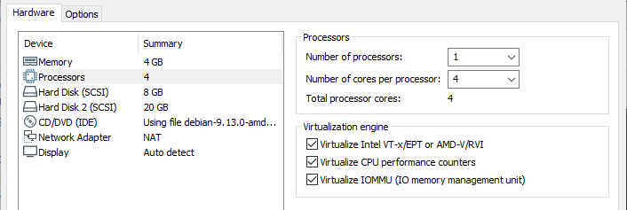

# VMware `docker-machine`

Implement Linux `docker-machine` on VMware Workstation/Player, VirtualBox,...

## Generate certificates for Docker TLS

### On Linux

Boot to [SystemRescueCD](https://www.system-rescue.org/) on an empty Virtual Machine, then execute `generate-tls.sh` on that

- Set root password and turn-off Firewall on `SysRescue`

```bash
# Get IP of the VM
ip r

echo 'root:toor' | chpasswd
systemctl stop iptables
```

- Send `generate-tls.sh` script to the VM then execute `generate-tls.sh [<Docker machine IP>]` to generate certificates

```bash
scp generate-tls.sh docker-ssl.cnf root@192.168.139.148:~

ssh root@192.168.139.148
chmod +x *.sh
./generate-tls.sh 192.168.139.140
exit

# Copy generated certificates back to the local
scp "root@192.168.139.148:~/{*.tgz,*.txt}" .
```

### On Windows

Prerequisites (`OpenSSH Client` and `7-Zip` are optional on Windows 10):

- OpenSSL v1.1.x (e.g. http://wiki.overbyte.eu/arch/openssl-1.1.1n-win64.zip)
- OpenSSH Client v7.x (e.g. https://github.com/PowerShell/Win32-OpenSSH/releases/download/v7.7.2.0p1-Beta/OpenSSH-Win64.zip)
- 7-Zip >= v19.0 (e.g. https://www.7-zip.org/a/7z1900-extra.7z)

Install them by extracting necessary executable files into any folder and export `PATH` environment variable for that

```batch
powershell -command "Expand-Archive -Force misc\tools-win64.zip C:\Apps\tools-x64"
set "PATH=%PATH%;C:\Apps\tools-x64"
```

Then execute `generate-tls.cmd [<Docker machine IP>]` to generate certificates, e.g. `generate-tls.cmd 192.168.139.140`

## Create the Virtual Machine

Recommended:

- OS: Debian 9.x 64-bit (or `Linux 4.x 64-bit` for `Alpine Linux`)
- VM name: debian9-docker
- CPU: 1 / Core: 4 (correspond with the system)
- Memory: 4GB (or 2GB for `Alpine Linux`)
- Printer: <none>
- Sound: <none>
- USB: <none>
- Network: NAT (generated MAC)
- Display: <auto>
- CDROM: <Use ISO image: path\to\debian-9.13.0-amd64-netinst.iso>
- HDD1: 8GB
- HDD2: 20GB



- Firmware: UEFI
- Shared Folders: <Always enabled C:\Users>


## Setup Docker machine on Debian 9

## Setup Docker machine on Alpine Linux 3
